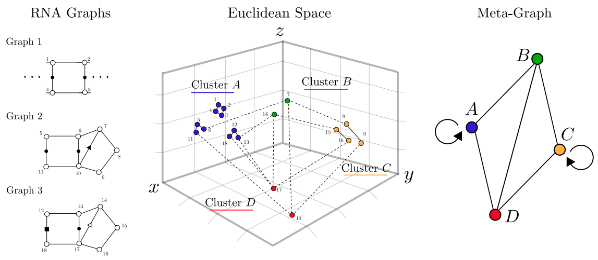

# vernal



`veRNAl` is an algorithm for identifying fuzzy recurrent subgraphs in RNA 3D networks.

Please cite:

```
@article{oliver2020vernal,
  title={VeRNAl: A Tool for Mining Fuzzy Network Motifs in RNA},
  author={Oliver, Carlos and Mallet, Vincent and Philippopoulos, Pericles and Hamilton, William L and Waldispuhl, Jerome},
  journal={arXiv preprint arXiv:2009.00664},
  year={2020}
}
```


See [full paper](https://arxiv.org/abs/2009.00664) for complete description of the algorithm.

You can view the results from an already trained model [here](http://vernal.cs.mcgill.ca/).


This repository has three main components:

* Preparing Data `/build_data`
* Subgraph Embeddings `/learning`
* Motif Building `/build_motifs`

## Install Dependencies

The command below will install the full list of dependencies.

The main packages we use are:

* multiset
* NetworkX 
* BioPython
* Pytorch
* DGL (Deep Graph Library)

```
conda env create -f environment.yml
conda activate vernal
```

## Data Preparation

Create two directories where the data will be kept:

```
mkdir data/graphs
mkdir data/annotated
```

Download RNA networks:

* [whole crystal structures (non-redundant)](https://mega.nz/file/lLpxjBJA#2H837fqO7VsVnLWpfT0bo4i04lFTeYSul5N_mY8pJW0)
* [whole graphs (non-redundant)](https://mega.nz/file/YWIHEQxQ#qRUCL8X9eV6NtViXgkZI1lOBlCfc_cWokvMgN-XB9B0)

Bulid the dataset

```
python build_data/main.py
```

## Subgraph Embeddings

Once the training data is built, we train the RGCN.

```
python learning/main.py -n my_model
```

## Motif Building

Finally, the trained RGCN and the whole graphs are used to build motifs.
